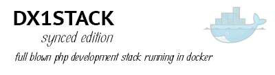

# docker-dxstack1-synced v1.0-rc3

**[STAY UP TO DATE about this product - subscribe to our email updates](http://eepurl.com/caYXEH)**

[View the CHANGELOG](doc/changelog.md)

[Available on Dockerhub](https://hub.docker.com/r/24hoursmedia/dxstack1-synced/)

## What is docker-dxstack1-synced?

A full stack of software running in a docker container mainly for php-developers. The stack contains
nginx, php-fpm, mariadb i.e. mysql, redis and memcached running on centos 7.

Your mysql and application data stay on the host, so you can easily discard the container (or replace with
a new version) without data loss.

The stack features NFS to local synced directories, boosting performance for composer
projects such as Symfony 2 and 3.

## For who is docker-dxstack1-synced?

* For advanced developers who know about docker, and how to configure nginx (and php-fpm)
* Developers who want a full featured and high performance development stack isolated on their computer
* Developers who want to their development environment to resemble an actual server

## Examples - tutorials

#### [Example #01: Set up a development stack](doc/examples/01-devstacksetup.md)

This example shows how to setup your host and activate the full development stack. 
[Go to the example](doc/examples/01-devstacksetup.md)

#### [Example #02: PHP Hello world application](doc/examples/02-helloworld.md)

After Example #01 is completed, we'll configure the stack's vhosts to show a hello world application. 
[Go to the example](doc/examples/02-helloworld.md)

#### [Example #03: Symfony](doc/examples/03-syncedsf.md)

Install a symfony application on a synchable directory for enhanced performance.
[Go to the example](doc/examples/03-syncedsf.md)

## Features

* full php and db  centos7stack featuring nginx, php-fpm, mariadb, memcached, and redis
* based on our dxstack1-base image [(learn more...)](https://github.com/24HOURSMEDIA/docker-dxstack1-base)
* customize nginx configuration through a mounted volume
* store data in the container through a mounted volume
* mounted volume is lsynced to the container's local filesystem through lsyncd for high application performance

