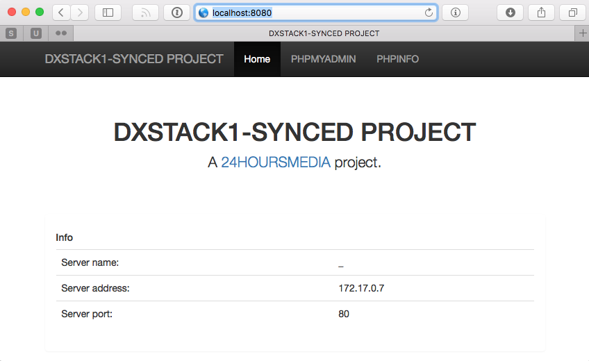
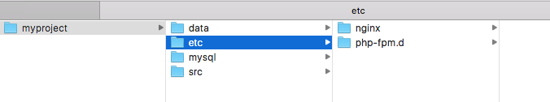
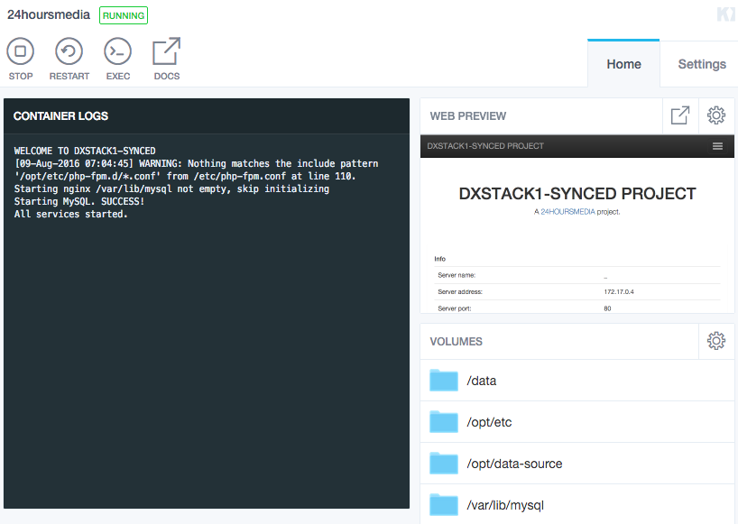

##### [< docker-dxstack1-synced](../../README.md)

**[STAY UP TO DATE about this product - subscribe to our email updates](http://eepurl.com/caYXEH)**

## example: full development stack setup


*Already walked through this example and have a development stack set up? Then move on to the [hello world php example](02-helloworld.md) where you'll configure nginx and php-fpm, and set up
                                                                                                     the simplest application.*


This example installs a development environment for you with NginX, PHP-FPM, MariaDB, PHPMyAdmin and more.

It creates shares so on your host (development computer) you can place your application files and data files,
where you can configure your vhosts and where mysql data is stored, so these will not be thrown away when the container is terminated.


Tested on [Docker for Mac OSX](https://docs.docker.com/docker-for-mac/). MAY work on other hosts (let me know if it does :))

Prerequisites:

- Docker service (Get it for [OSX](https://docs.docker.com/docker-for-mac/) or [WINDOWS](https://docs.docker.com/docker-for-windows/))
- A Dockerhub account

### Step 1: Create project directories

On your host, we'll create a directory structure for the stack. We'll name the stack 'myproject'
(substitute myproject with your own whenever applicable).

Make sure your docker service has access to these directories (on Mac or Win through the Docker icon > Preferences)

```
# In the terminal on your host

# this will contain mysql data
mkdir -p ~/docker/myproject/mysql
# this will contain data that will be ‘synced’ automatically to container’s local fs. Put your app files here (advanced)
mkdir -p ~/docker/myproject/src
# this will contain another data store (available as nfs). Put your app and data files here
mkdir -p ~/docker/myproject/data
# this will contain files to configure nginx and php-fpm
mkdir -p ~/docker/myproject/etc
```

### Step 2: Make sure you are logged in at DockerHub.

If you are not logged in, on your host in the terminal:

```
# In the terminal on your host
docker login
```

### Step 3: Launch the container

Next, launch the container. This will:

* expose port 8080 on your host so you can connect to the Nginx webserver/reverse proxy
* if the mysql directory is empty, initialize mysql and set a user **developer** with no password
* install a management application with phpMyAdmin, reachable through http://localhost:8080
* mount the directories you created above in the container, so you can place data and application
 files on your host that are available in the container.
* log you in in the shell of the container
 
 
```
# In the terminal on your host, run:
docker run --name=myproject -h=myproject.com \
-p 8080:80 \
-v ~/docker/myproject/mysql:/var/lib/mysql \
-v ~/docker/myproject/src:/opt/data-source \
-v ~/docker/myproject/data:/data \
-v ~/docker/myproject/etc:/opt/etc \
-ti 24hoursmedia/dxstack1-synced:v1.0-rc3

```

### Step 4: Inspect your container

#### running services
You should now have a container running several services. In your container, execute the 'top' command to see if everything runs;
output should be as below

```
top

29 nginx     20   0  110088   5464   3008 S   0.3  0.3   0:00.01 nginx                                                                                                                                                                                                                                                                                        
31 root      20   0   39120   3456   2452 S   0.3  0.2   0:00.13 redis-server                                                                                                                                                                                                                                                                                 
 1 root      20   0   11784   2892   2632 S   0.0  0.1   0:00.03 bash                                                                                                                                                                                                                                                                                         
10 root      20   0   12100   2168   1728 S   0.0  0.1   0:00.00 lsyncd                                                                                                                                                                                                                                                                                       
18 root      20   0  419840   9676   2868 S   0.0  0.5   0:00.00 php-fpm                                                                                                                                                                                                                                                                                      
19 www-data  20   0  419840   9220   2412 S   0.0  0.5   0:00.00 php-fpm                                                                                                                                                                                                                                                                                      
24 root      20   0  109644   2080     48 S   0.0  0.1   0:00.00 nginx                                                                                                                                                                                                                                                                                        
25 nginx     20   0  110088   5464   3008 S   0.0  0.3   0:00.00 nginx                                                                                                                                                                                                                                                                                        
26 nginx     20   0  110088   5464   3008 S   0.0  0.3   0:00.01 nginx                                                                                                                                                                                                                                                                                        
28 nginx     20   0  110088   5464   3008 S   0.0  0.3   0:00.01 nginx                                                                                                                                                                                                                                                                                        
36 memcach+  20   0  314860   1712   1472 S   0.0  0.1   0:00.00 memcached                                                                                                                                                                                                                                                                                    
49 root      20   0   11784   2716   2400 S   0.0  0.1   0:00.02 mysqld_safe 
```

### Overview

Now the stack is set up and running, you have:

#### Administration default application

In your webbrowser, you should now have access to the container's default webapplication.

Navigate to http://localhost:8080 and you can inspect php configuration and manage the database:



#### Directory structure

The directory structure you set up earlier, is now filled with data and some sample files.

* etc contains the configuration for your vhosts and php-fpm pools;
* data can contain data on your host computer that is mounted in the container on /data
* mysql contains the mysql data files so you database contents will persist
* src can contain data that is mounted in the container on /opt/data-source (and will be synced to /opt/data-synced)





#### Kitematic

If you have kitematic installed on your host, you can start/stop the container here and login to the
shell. (You may have to quit and startup kitematic again to view the container since kitematic is in beta). 



### Next

*Move on to the [hello world php example](02-helloworld.md) where you'll configure nginx and php-fpm, and set up
the simplest application.*


### You should now:

***How to restart Nginx to update the vhosts configuration..***

Do this by executing the following two commands in the container:
```
/etc/init.d/nginx stop
/etc/init.d/nginx start
```

***How to restart php-fpm to initialize the pools..***

Do this by executing the following two commands in the container:
```
pkill php-fpm
php-fpm
```

***How to activate the php-fpm default www pool***

This pool listens on port 9000 with TCP/IP but is not activated by default. Activate the pool by 
renaming (on the host) the myproject/etc/php-fpm.d/www.conf.example to www.conf, and then restart php-fpm in the
container.

You can then set up nginx fastcgi proxies using the standard *fastcgi_pass 127.0.0.1:9000;*

Alternatively, you can use the container default's *fastcgi_pass unix:/var/run/php5fpm-www-default.sock;* which
is also used by the administration application (but has limited resources).

***Where you can place your nginx virtual host files***

These can be placed on the host in *myproject/etc/nginx/vservers/MYVSERVER.conf* location.
You shoul restart nginx after placing the file. And also, make nginx listen to a domain name
to avoid conflicts with the default domain, and add this domain name in your host computer's hosts file
(i.e. 127.0.0.1 myproject.domain).

***About the synced directory***

Files that you place in *myproject/source* host directory are available in the container at the mount
point */opt/data-source*.

They are synced (with lsyncd) to */opt/data-synced* so in the container you have non-NFS access to these files.
This is a lot faster; use this when deploying php composer projects for example.

Also, the synced files and directories are assigned the php-fpm user (www-data)
and correct permissions so both nginx and php-fpm have access to these files.

In the container, */source* is symlinked to */opt/data-synced* so you can use */source* instead when configuring
nginx. This way you can change to non-synced if you want without any problems.

Be aware that you or your application should not put data (for example file uploads) in the synced
directories (/source and /opt/data-source) as this will vanish on sync. Use the /data mount instead.


