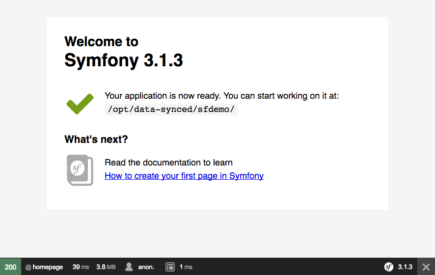

##### [< docker-dxstack1-synced](../../README.md)

**[STAY UP TO DATE about this product - subscribe to our email updates](http://eepurl.com/caYXEH)**

## example 03: symfony synced application

After completing
[example 01](01-devstacksetup.md) and [example 02](02-helloworld.md), we'll install a default Symfony application.


This example assumes you have a php-fpm pool configured as in [Example #02: PHP Hello world application](02-helloworld.md)
(i.e. running over TCP/IP on 127.0.0.1:9000)


This example takes a different approach, in that it uses the /opt/data-source directory (NFS mount) to
place symfony in. This directory is synced to the local file system of the container (to /opt/data-sync).

Nginx lets php point to the *synced* files instead of the source files on the NFS. With this
we gain a huge performance boost, as NFS is not exactly up to speed for symfony running in app_dev.php mode.


#### step 1: assign a hostname

On your host computer, add the following entry to you /etc/hosts file (root privileges required) or
configure a dns server:

    127.0.0.1 sfdemo.devsite

This is the domain name where our hello world application will run.


In the container,

```
cd /opt/data-source
symfony new sfdemo
```

Now, configure nginx for the application. In the container,

```
gist=https://gist.githubusercontent.com/24HOURSMEDIA/559db0b1b700aa31bdfd45d7a9a28a9d/raw/50858127a9d60e7ec1e351310191e88eab360abd/dxstack1synced-sfdemo.vserver
curl $gist > /opt/etc/nginx/vservers/sfdemo.vserver
# test nginx configuration
nginx -t
# reload nginx
/etc/init.d/nginx stop
/etc/init.d/nginx start
```

You can test the symfony application by going to

http://sfdemo.devsite:10080/

or

http://sfdemo.devsite:10080/app_dev.php

Despite what symfony tells you, do NOT work in /opt/data-synced/sfdemo; your files will get overwritten. Use /opt/data-source/sfdemo instead!
Also, make sure file uploads etc are stored in a safe place (/data is a good one) and let nginx point to
that location if applicable.




